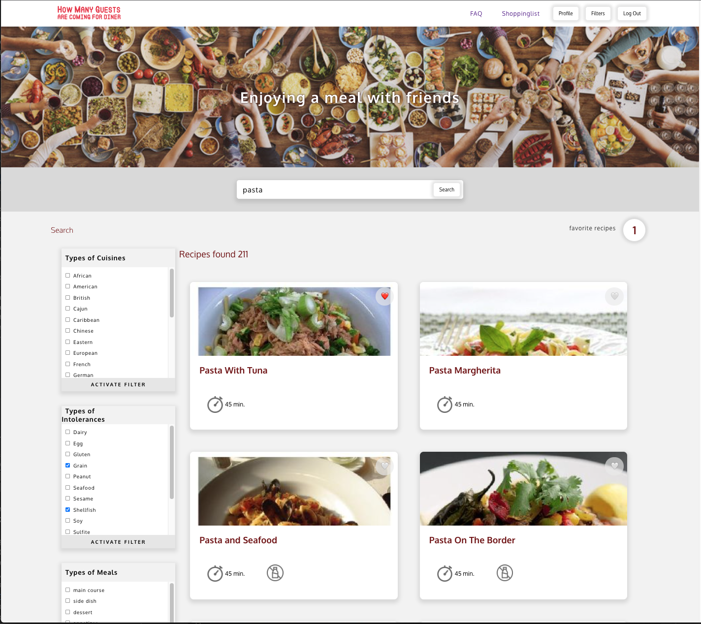

# Grocerylist calculated for number of guests coming for diner

Ik heb een applicatie ontwikkeld die gaat helpen bij het maken van één boodschappenlijst van alle ingrediënten, aangepast aan het aantal personen wat komt eten. 
Het werkt in 4 stappen: \
1 - zoek een gerecht\
2 - voeg het toe aan favorieten\
3 - geef per gerecht het aantal personen aan waarvoor u het gerecht gaat bereiden\
4 - print de aangepaste boodschappenlijst\

# Preview

# Installatie
Clone deze git-repository via de groene button, of via jouw editor naar uw locale machine.

Open de applicatie in de editor en installeer alle benodigde dependencies met de volgende code: 

`npm install`

## Benodigde abonnement
De applicatie maakt gebruik van de api-key van Spoonacular.\
Er is een gratis api-key beschikbaar om de applicatie te gebruiken.\
U kunt eventueel een andere api-key aanschaffen om meer data te kunnen ontvangen via:\
https://spoonacular.com/food-api \
Documentatie voor de spoonacular api vindt u hier: \
https://spoonacular.com/food-api/docs

Om de beschikbare api-key te gebruiken, maakt u een nieuw bestand aan in de root-folder genaamd:\
`.env-file`

Plaats daarin de volgende code:
#### `REACT_APP_SPOONACULAR_KEY=c3cb27d6fbfc48f4977ee4ac7143e983`

## Account kunt u zelf aanmaken
In het account kunt u filtervoorkeuren instellen.

Deze applicatie maakt gebruik van de NOVI-Back-end: \
Lees hier meer informatie hierover:\
https://github.com/hogeschoolnovi/novi-educational-backend-documentation 

## Available Scripts

Start de applicatie met:

### `npm start`

De app wordt gestart in ontwikkelings-mode.\
Open [http://localhost:3000](http://localhost:3000) om het te bekijken in de browser.

Na iedere wijziging zal de pagina herladen.\

### `npm test:watch`

Start de test-runner in de watch-mode.\
Lees hier meer informatie hierover: [running tests](https://facebook.github.io/create-react-app/docs/running-tests).

### `npm run build`

Builds the app for production to the `build` folder.\
It correctly bundles React in production mode and optimizes the build for the best performance.

The build is minified and the filenames include the hashes.\
Your app is ready to be deployed!

See the section about [deployment](https://facebook.github.io/create-react-app/docs/deployment) for more information.